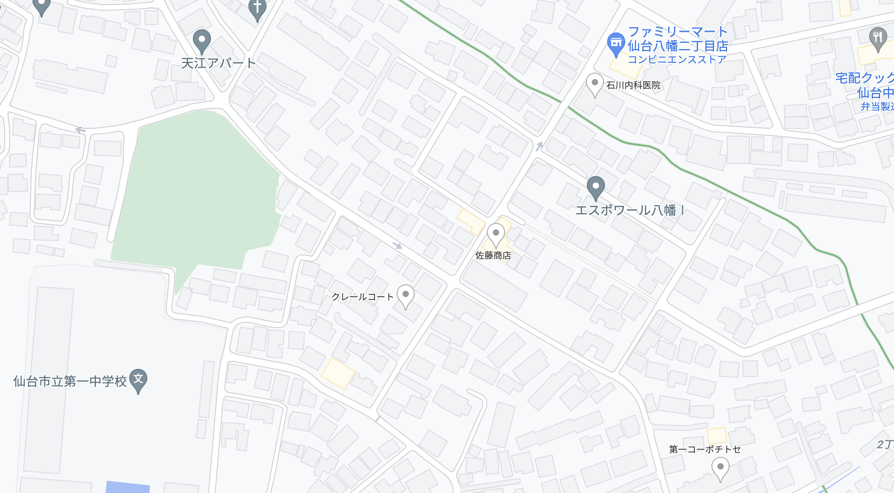

# LatLng-mapの使い方
ここでは、シリアルから送られてきた","区切りの座標データをもとに地図にその場所をリアルタイムで表示するWebアプリ(LatLun-map)の使い方を説明しています。
## 必要な定数の変更
※ローカル環境で動かす時以外は変更できません。
```
const BAUD_RATE = 19200;     //シリアル通信のボードレート
const INTERVAL = 2000;       //map更新の頻度(ms)
const STATUS = Object.freeze({    //Object.freezeは書き換え不可にする
    TOP_LAT: 38.26101,       //地図画像左上端の緯度
    TOP_LNG: 140.84879,      //地図画像左上端の経度
    BOTTOM_LAT: 38.25923,    //地図画像右下端の緯度
    BOTTOM_LNG: 140.85268,   //地図画像左上端の経度
    IMG_WIDTH: 1100,         //地図画像の横幅(htmlで表示している横幅のこと)
    IMG_HEIGHT: 800          //地図画像の縦幅
    });
```
この部分をコメントの通りに変更します。
  
以下にあるURLでは、上記のコードで初期化されています。
## 使い方
* URLは[https://from-the-earth.github.io/FTE_12th/LatLng-map/index.html](https://from-the-earth.github.io/FTE_12th/LatLng-map/index.html)にあります。
* "Connect"ボタンを押し、適当なUSBポートを選択するとシリアルポートからのデータを取得し始めます。
* 終了する場合は、USBをポートから抜くか、ページをリロードして下さい。
## デモンストレーション
* Arduinoにこのリポジトリ内にあるdemo.inoを書き込んで、シリアル接続すると、動きを確認できます。(`kawauchi.png`を使ってください。)

## データ
* `kawauchi.png`
```
TOP_LAT: 38.26101,       //地図画像左上端の緯度
TOP_LNG: 140.84879,      //地図画像左上端の経度
BOTTOM_LAT: 38.25923,    //地図画像右下端の緯度
BOTTOM_LNG: 140.85268,   //地図画像左上端の経度
IMG_WIDTH: 1100,         //地図画像の横幅(htmlで表示している横幅のこと)
IMG_HEIGHT: 800
```
```
<div class="wrapper">
    
    
</div>
```
* `kato.png`
```
TOP_LAT: 38.27464,       //地図画像左上端の緯度
TOP_LNG: 140.84572,      //地図画像左上端の経度
BOTTOM_LAT: 38.272154,    //地図画像右下端の緯度
BOTTOM_LNG: 140.851539,   //地図画像左上端の経度
IMG_WIDTH: 1000,         //地図画像の横幅(htmlで表示している横幅のこと)
IMG_HEIGHT: 550          //地図画像の縦幅
```
```
<div class="wrapper">
    
    
</div>
```
